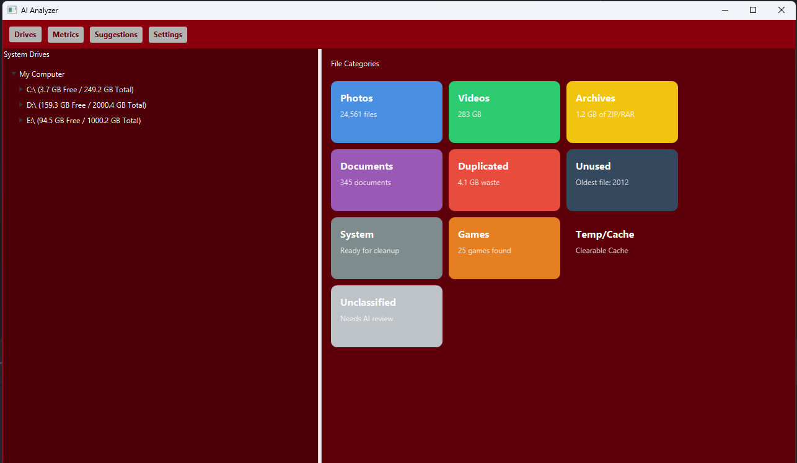
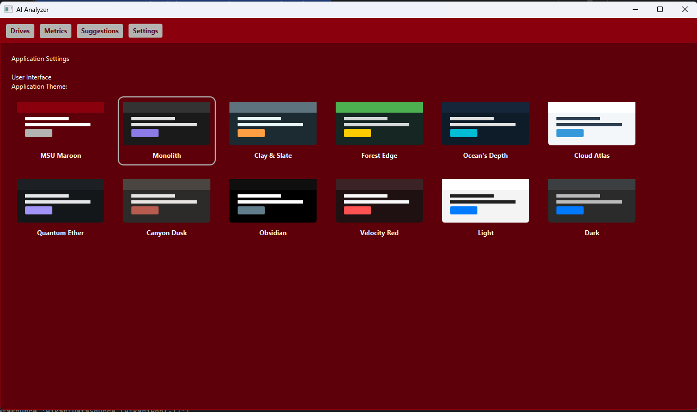
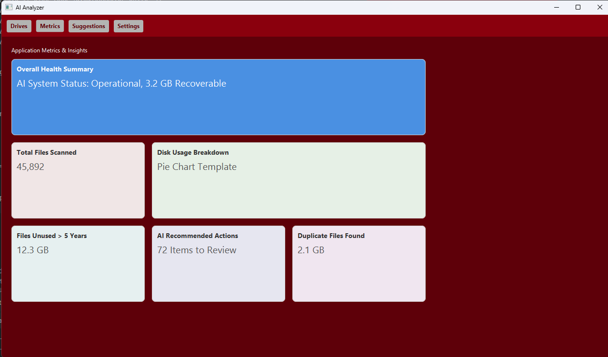
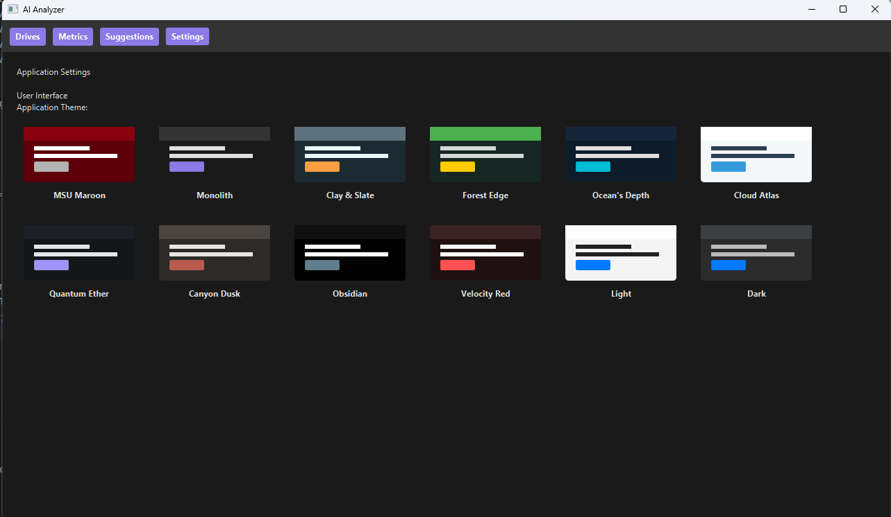
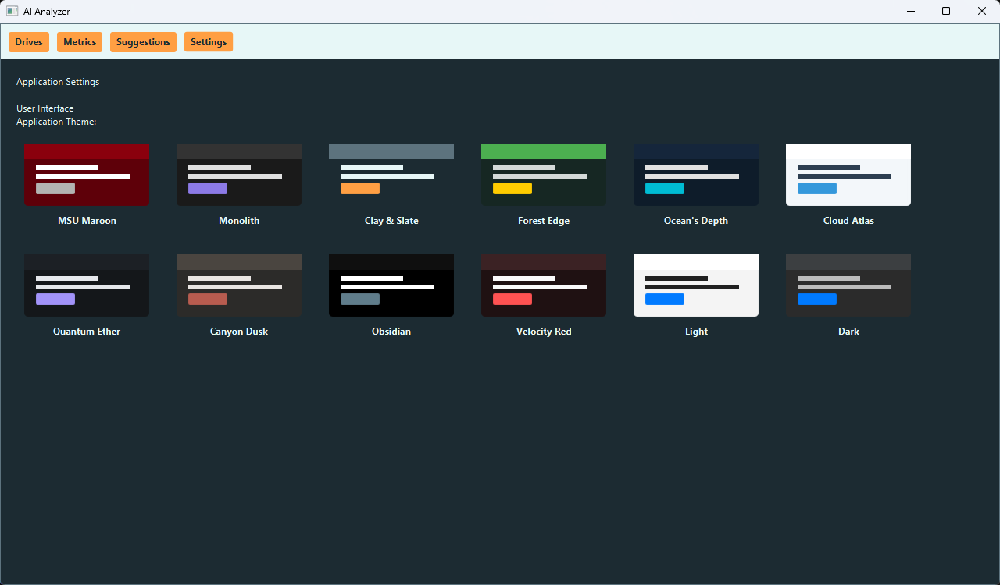
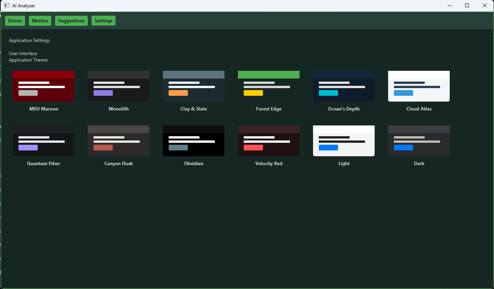
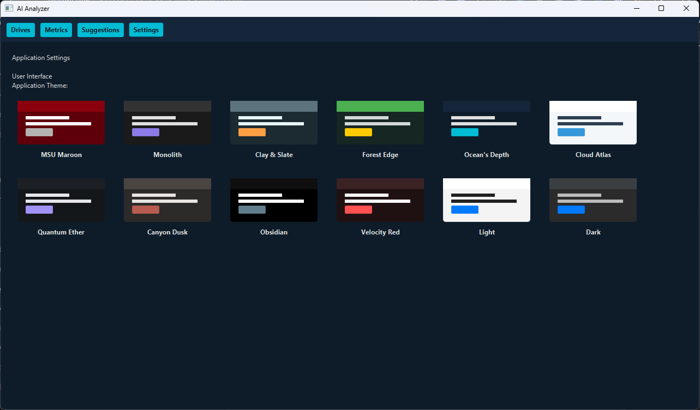
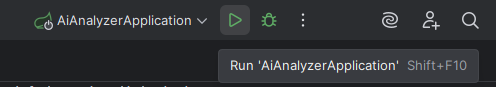

<<<<<<< HEAD
<p align="center">
=======
<p align="center">
>>>>>>> clean-feature-branch
  
</p>

<h1 id="aianalyzer" align="center">File AiAnalyzer</h1>

<p align="center">
<<<<<<< HEAD
  
  
=======
  
  
>>>>>>> clean-feature-branch
  
  
  
</p>

<<<<<<< HEAD

<hr style="border: 0.5px solid #ccc; margin: 20px 0;">


=======
<hr style="border: 0.5px solid #ccc; margin: 20px 0;">

>>>>>>> clean-feature-branch
<!-- Main large image -->
<p align="center">
  <br>
  <em>Main Dashboard Interface</em>
</p>

<!-- Two smaller images side by side -->
<p align="center">
  
  <br>
  <em>Theme Selection (left) &nbsp;&nbsp;•&nbsp;&nbsp; Metric Reports (right)</em>
</p>

<<<<<<< HEAD
<p style="text-align: right;">
  <a href="#aianalyzer">Back to Top ↑</a>
</p>

## Themes
<table align="center">
  <tr>
    <td align="center">
      <br>
      <em>Monolith</em>
    </td>
    <td align="center">
      <br>
      <em>Clay & Slate</em>
    </td>
    <td align="center">
      <br>
      <em>Forest Edge</em>
    </td>
  </tr>
  <tr>
    <td align="center">
      <br>
      <em>Oceans Depth</em>
    </td>
    <td align="center">
      <br>
      <em>Obsidian</em>
    </td>
    <td align="center">
      <!-- empty cell to keep layout balanced -->
    </td>
  </tr>
</table>

=======
>>>>>>> clean-feature-branch
<p align="center">
  <a href="#getting-started--setup">Getting Started</a> •
  <a href="#project-structure">Project Structure</a> •
  <a href="#technology-stack">Tech Stack</a> •
<<<<<<< HEAD
  <a href="#contributors">Contributors</a>
</p>

## Key Features
<table>
<tr><td>

- **File System Scanning:** Performs both high-speed active scans and low-impact passive monitoring.
- **AI-Powered Classification:** Uses the Gemini AI model to classify files as safe, suspicious, or junk.

</td><td>

- **Desktop GUI:** Clean, intuitive desktop interface built with JavaFX.
- **Detailed Reporting:** Provides insight into file categories, duplicates, and disk usage.

</td></tr> </table>


## Getting Started & Setup
First-time setup is required. You must configure your Gemini API key and connect IntelliJ to the database.

**>> See [README_AI.md](README_AI.md) and [README_DATABASE.md](README_DATABASE.md) for full setup instructions.**

=======
  <a href="#how-to-run">How to Run</a> •
  <a href="#contributors">Contributors</a>
</p>

## Overview
File AiAnalyzer is a desktop application that scans local files, applies AI-driven analysis (including image understanding and malware checks), and persists results and metrics. It pairs a JavaFX user interface with a Spring Boot backend and SQLite database.

## Key Features
- File System Scanning (active and background queues)
- AI-Powered Classification (files and images)
- Desktop UI (JavaFX) with theming
- Metrics and reporting (counts, throughput, user actions)
- Persistent storage (SQLite via Spring Data JPA)

<p style="text-align: right;">
  <a href="#aianalyzer">Back to Top ↑</a>
</p>

## Getting Started & Setup
First-time setup is required. Configure your AI credentials and database.

See:
- README_AI.md — AI service setup and usage
- README_DATABASE.md — Database configuration, schema, and tips

### Quick start (Windows / IntelliJ)
1. Open the project in IntelliJ IDEA.
2. Ensure JDK 21 and JavaFX are configured in the IDE.
3. Run the main class: `src/main/java/edu/missouristate/aianalyzer/AiAnalyzerApplication.java`
4. Maven:
   - Build: `mvn clean package`
   - Run (dev): `mvn spring-boot:run`
   - Run jar: `java -jar target/<artifact>-<version>.jar`
5. Tests: `mvn test`

### Common paths (fast links)
- Properties: `src/main/resources/application.properties`
- Logging: `src/main/resources/logback.xml`
- UI (views, services): `src/main/java/edu/missouristate/aianalyzer/ui`
- AI services: `src/main/java/edu/missouristate/aianalyzer/service/ai`
- Persistence: `src/main/java/edu/missouristate/aianalyzer/model/database` and `repository/database`
- Metrics: `src/main/java/edu/missouristate/aianalyzer/service/metrics`
>>>>>>> clean-feature-branch

<p style="text-align: right;">
  <a href="#aianalyzer">Back to Top ↑</a>
</p>

## Project Structure
<details>
<summary>Click to view the collapsed project structure</summary>

```
src/main/
├── java/
│   └── edu/missouristate/aianalyzer/
│       ├── AiAnalyzerApplication.java    <- [Entry Point]
<<<<<<< HEAD
│       ├── config/..                     <- Holds Spring @Configuration beans for setup.
│       ├── model/..                      <- Defines data structures and database tables (@Entity classes).
│       ├── repository/..                 <- Handles database queries (e.g., find, save, delete).
│       ├── service/..                    <- Contains the core backend business logic.
│       └── ui/..                         <- Contains all frontend JavaFX code.
└── resources/..                          <- Spring Boot configuration for the database, CSS files for UI
=======
│       ├── config/..                     <- Spring @Configuration beans and AI client setup.
│       ├── model/..                      <- Data structures and JPA @Entity classes for database tables.
│       ├── repository/..                 <- Spring Data JPA repositories (query interfaces).
│       ├── service/..                    <- Core backend business logic (AI, DB operations, metrics).
│       ├── ui/..                         <- JavaFX frontend code (views, events, services).
│       └── utility/..                    <- Helper utilities for AI operations and file handling.
└── resources/..                          <- Config files, CSS themes, and logging setup.
>>>>>>> clean-feature-branch
```

</details>

<<<<<<< HEAD
<details>
<summary>Click to view the expanded project structure</summary>

```src/main/
└── java/
    └── edu/missouristate/aianalyzer/
        ├── AiAnalyzerApplication.java           <- The main entry point; its main() method starts the entire application.
        ├── config/
        │   └── AiClient.java                    <- Sets up the connection to the Google Gemini AI service.
        ├── model/
        │   ├── database/
        │   │   ├── FileRecord.java              <- The main table; stores final metadata for a scanned file.
        │   │   ├── ImageMeta.java               <- Stores special metadata extracted only from image files.
        │   │   ├── LabelHistory.java            <- Tracks the history of AI classifications for a file over time.
        │   │   └── ScanQueueItem.java           <- A temporary task in the queue; a file waiting to be processed.
        │   └── FileInterpretation.java          <- A data class that defines the type of AI analysis to perform.
        ├── repository/
        │   └── database/
        │       ├── FileRecordRepository.java    <- Provides methods to query the files table.
        │       ├── ImageMetaRepository.java     <- Provides methods to query the image_meta table.
        │       ├── LabelHistoryRepository.java  <- Provides methods to query the label_history table.
        │       └── ScanQueueItemRepository.java <- Provides methods to query the scan_queue table.
        ├── service/
        │   ├── ai/
        │   │   ├── AiQuery.java                 <- Contains the actual text prompts that are sent to the Gemini AI.
        │   │   └── ProcessFile.java             <- Reads files (handling large ones) and uses AiQuery to get an analysis.
        │   └── database/
        │       ├── ActiveScanService.java       <- "Producer" that adds files to the queue from a user-initiated scan.
        │       ├── FileProcessingService.java   <- "Consumer" that processes items from the queue.
        │       ├── LabelService.java            <- Parses the AI's response and applies the classification label to a file.
        │       └── PassiveScanService.java      <- "Producer" that adds files to the queue by monitoring the filesystem.
        └── ui/
            ├── event/
            │   └── StageReadyEvent.java         <- A signal fired when the UI is ready to be built.
            ├── service/
            │   ├── FileSystemService.java       <- Handles file system operations like getting child folders for the UI.
            │   └── ThemeService.java            <- Manages applying and changing CSS themes.
            ├── view/
            │   ├── Home/
            │   │   ├── DriveView.java           <- The main screen for browsing drives and file categories.
            │   │   └── FileTreeItem.java        <- A custom tree item that lazy-loads folders in the background.
            │   ├── Metrics/
            │   │   └── MetricsView.java         <- The screen for displaying statistics about scanned files.
            │   ├── Settings/
            │   │   └── SettingsView.java        <- The screen for changing application settings, like the theme.
            │   └── Suggestions/
            │       └── SuggestionsView.java     <- The screen for showing AI-powered suggestions.
            ├── JavaFxApplication.java           <- The entry point for the JavaFX UI; it starts Spring and manages the UI lifecycle.
            └── StageInitializer.java            <- Builds the main application window once Spring and JavaFX are ready.

```

</details>

<div align="center">

### Role-Based File Guide

| AI Development | Database Development | UI/Frontend Development |
| :---: | :---: | :---: |
| [`service/ai`](src/main/java/edu/missouristate/aianalyzer/service/ai) | [`model/database`](src/main/java/edu/missouristate/aianalyzer/model/database) | [`ui/JavaFxApplication.java`](src/main/java/edu/missouristate/aianalyzer/ui/JavaFxApplication.java) |
| | [`repository/database`](src/main/java/edu/missouristate/aianalyzer/repository/database) | [`ui/StageInitializer.java`](src/main/java/edu/missouristate/aianalyzer/ui/StageInitializer.java) |
| | [`service/database`](src/main/java/edu/missouristate/aianalyzer/service/database) | [`ui/view/`](src/main/java/edu/missouristate/aianalyzer/ui/view) |
| | | [`ui/service/`](src/main/java/edu/missouristate/aianalyzer/ui/service) |
| **_For full details:_** | **_For full details:_** | **_For full details:_** |
| See **[README_AI.md](README_AI.md)** | See **[README_DATABASE.md](README_DATABASE.md)** | (See main README) |

</div>

## How to Run
- Database (see [README_DATABASE.md](README_DATABASE.md))
- UI Window

<p align="center">
  
</p>

- TODO: Run .exe

<p style="text-align: right;">
  <a href="#aianalyzer">Back to Top ↑</a>
</p>


## Technology Stack
| Category          | Technology                                           |
| :---------------- | :--------------------------------------------------- |
| **Language** | Java 17                                            |
| **Backend** | Spring Boot 3.5.5, Spring Data JPA / Hibernate |
| **Frontend** | JavaFX 21                                          |
| **Database** | SQLite                                             |
| **Build & Tools** | Maven, Lombok                                    |
| **Services** | Google GenAI for Java                              |
<p align="center">
  
</p>

## Contributors
This project is a collaborative effort by:

| Name          | Role               | GitHub Profile                                  |
|---------------|--------------------|-------------------------------------------------|
| Reese McClurg | Backend / Database | [@ReeseMcClurg](https://github.com/ReeseMcClurg) |
| Jake Schildknecht         | AI Integration     | [@jakeschild9](https://github.com/jakeschild9)  |
| Josh Dejeu    | UI / Frontend      | [@JoshDejeu](https://github.com/JoshDejeu)      |

<p align="center">

## License

This project is licensed under the [MIT License](LICENSE).

  
</p>


<p style="text-align: right;">
  <a href="#aianalyzer">Back to Top ↑</a>
</p>
=======

<details>
<summary>Click to view the expanded project structure</summary>

```
src/main/
├── java/
│   └── edu/missouristate/aianalyzer/
│       ├── AiAnalyzerApplication.java            <- The main entry point; its main() starts Spring Boot and the entire app.
│       ├── config/
│       │   ├── AiClient.java                     <- Sets up and configures the Google Gemini AI client.
│       │   └── ServiceLoggingAspect.java         <- AOP aspect for cross-cutting service method logging.
│       ├── model/
│       │   ├── FileInterpretation.java           <- Domain model describing AI output and file classification.
│       │   └── database/
│       │       ├── DecisionType.java             <- Enum for user decisions (Ignore, Quarantine, Delete).
│       │       ├── ErrorLog.java                 <- Entity for tracking processing errors.
│       │       ├── FileRecord.java               <- Main table; stores metadata and AI analysis results.
│       │       ├── FileTypeMetrics.java          <- Aggregated metrics per file type/extension.
│       │       ├── ImageMeta.java                <- Specialized metadata extracted from image files.
│       │       ├── LabelHistory.java             <- History of AI-generated labels for each file.
│       │       ├── MetricsSummary.java           <- System-wide aggregated counters and metrics.
│       │       ├── PreferenceAudit.java          <- Audit trail of user preference changes.
│       │       ├── ScanQueueItem.java            <- A queued work item representing a file waiting to be analyzed.
│       │       ├── UserDecisionLog.java          <- Logs user actions on files (ignore, quarantine, delete).
│       │       ├── UserPreference.java           <- Stores user-configurable settings.
│       │       └── VirusScan.java                <- Virus scan results per file.
│       ├── repository/
│       │   └── database/
│       │       ├── ErrorLogRepository.java       <- CRUD operations for ErrorLog.
│       │       ├── FileRecordRepository.java     <- Persistence and queries for FileRecord.
│       │       ├── FileTypeMetricsRepository.java<- CRUD operations for FileTypeMetrics.
│       │       ├── ImageMetaRepository.java      <- Persistence for ImageMeta.
│       │       ├── LabelHistoryRepository.java   <- CRUD operations for LabelHistory.
│       │       ├── MetricsSummaryRepository.java <- CRUD operations for MetricsSummary.
│       │       ├── PreferenceAuditRepository.java<- CRUD operations for PreferenceAudit.
│       │       ├── ScanQueueItemRepository.java  <- Persistence for ScanQueueItem.
│       │       ├── UserDecisionLogRepository.java<- CRUD operations for UserDecisionLog.
│       │       ├── UserPreferenceRepository.java <- CRUD operations for UserPreference.
│       │       └── VirusScanRepository.java      <- Persistence for VirusScan.
│       ├── service/
│       │   ├── CloudConfigService.java           <- Manages Google Cloud configuration (project, bucket, credentials).
│       │   ├── ai/
│       │   │   ├── ProcessFileService.java       <- AI processing for general files; handles large-file chunking.
│       │   │   ├── ProcessImageService.java      <- AI processing for image files.
│       │   │   └── ScanForVirusService.java      <- Integrates virus scanning into processing workflow.
│       │   ├── database/
│       │   │   ├── ActiveScanService.java        <- Producer adding files to the queue on user-initiated scans.
│       │   │   ├── ErrorLogService.java          <- Persists and retrieves system error logs.
│       │   │   ├── ErrorRetryWorker.java         <- Background worker retrying failed tasks.
│       │   │   ├── FileIsolationService.java     <- Handles quarantine and restoration operations.
│       │   │   ├── FileProcessingService.java    <- Consumer processing queued items; orchestrates AI + persistence.
│       │   │   ├── LabelService.java             <- Parses AI responses and applies classification labels.
│       │   │   ├── PreferenceChangedEvent.java   <- Event fired when user preferences are changed.
│       │   │   ├── PreferenceService.java        <- Reads/writes preferences; publishes change events.
│       │   │   ├── SearchService.java            <- Search/filter operations across file records.
│       │   │   └── VirusScanService.java         <- Coordinates and persists virus scan results.
│       │   ├── metrics/
│       │   │   ├── HomeMetricsService.java       <- Aggregates metrics for the home screen.
│       │   │   ├── MetricsAggregationService.java<- Aggregates data for dashboards, charts, and reports.
│       │   │   └── MetricsService.java           <- Helpers and utilities for metrics calculations.
│       │   └── photos/
│       │       └── FindDuplicatesService.java    <- Finds duplicate photos via perceptual hashing.
│       ├── ui/
│       │   ├── JavaFxApplication.java            <- Bootstraps JavaFX; bridges JavaFX lifecycle with Spring Boot.
│       │   ├── StageInitializer.java             <- Builds primary stage, loads scenes, shows first view.
│       │   ├── event/
│       │   │   └── StageReadyEvent.java          <- Event fired when JavaFX stage is ready.
│       │   ├── service/
│       │   │   ├── FileSystemService.java        <- File system utilities for UI directory and metadata retrieval.
│       │   │   ├── ThemeManager.java             <- Discovers installed themes and exposes theme palettes.
│       │   │   ├── ThemeService.java             <- Applies and switches UI themes.
│       │   │   └── UIUpdateService.java          <- Batches UI updates on the JavaFX application thread.
│       │   └── view/
│       │       ├── Home/
│       │       │   ├── CategoryCard.java         <- Reusable card component for file category metrics.
│       │       │   ├── DriveView.java            <- Main home screen: drives, categories, explorer.
│       │       │   ├── ExplorerFileCell.java     <- Custom renderer for file items (status, size, actions).
│       │       │   ├── FileItemModel.java        <- Model for file/folder items in the UI tree.
│       │       │   └── FileTreeItem.java         <- Lazy-loads folder contents; computes sizes in background.
│       │       ├── Metrics/
│       │       │   ├── MetricCard.java           <- Dashboard card w/ sparklines for metric visualization.
│       │       │   └── MetricsView.java          <- Metrics dashboard screen (charts, counts, throughput).
│       │       ├── Settings/
│       │       │   └── SettingsView.java         <- Settings screen for themes and cloud configuration.
│       │       └── Suggestions/
│       │           ├── SuggestionsItemCell.java  <- Custom cell renderer for AI suggestions.
│       │           └── SuggestionsView.java      <- AI-powered recommendations for file cleanup.
│       └── utility/
│           └── ai/
│               ├── AiQueryUtil.java              <- Helper for forming/sending prompts to the AI service.
│               ├── ClamDownloadUtil.java         <- Downloads and installs ClamAV.
│               ├── ImageMagickDownloadUtil.java  <- Downloads/configures ImageMagick for image processing.
│               ├── ReadFileUtil.java             <- Reads and chunks large files for AI processing.
│               ├── ReadImageUtil.java            <- Prepares image files for AI vision analysis.
│               └── UploadFileUtil.java           <- Uploads files to Google Cloud Storage.
└── resources/
    ├── application.properties                     <- Spring Boot config (DB, logging, feature flags, cloud).
    ├── logback.xml                                <- Structured logging configuration.
    └── styles/                                    <- CSS theme files for JavaFX.
```

</details>
>>>>>>> clean-feature-branch
