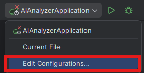
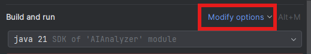
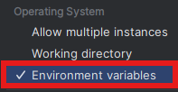
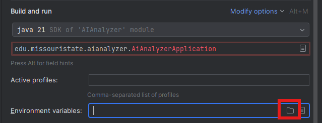

## Initial Setup: How to Get and Configure a GEMINI API Key

> [!WARNING]
> **API Key Required:** The application will not run without a valid Google Gemini API key. The following steps are mandatory for the application to function.

### Configuring the API Key in IntelliJ

1.  Visit **[https://aistudio.google.com/app/apikey](https://aistudio.google.com/app/apikey)** to generate an API key. It's free and does not require a billing account.
2.  Create a new file named `env.properties` in the project's root directory (at the same level as `pom.xml`).

> [!TIP]
> See the `env.properties.example` file included in the project for a template you can use.

3.  Paste your API key into the `env.properties` file using the following format:
    ```properties
    GEMINI_API_KEY=YOUR_KEY_HERE
    ```
4.  In IntelliJ, navigate to the run configuration dropdown in the toolbar (it should say **`AiAnalyzerApplication`**) and select **`Edit Configurations...`**.

    <p align="center">
      
    </p>

5.  In the Run/Debug Configurations window, click on **`Modify options`** and select **`Environment variables`** to enable the section.

    <p align="center">
      
      
    </p>
    <p align="center"><em>Enabling the Environment variables section</em></p>

6.  In the newly visible **Environment variables** field, click the folder icon next to *`Environment variables:`* and select the `env.properties` file you just created.

    <p align="center">
      
    </p>

7.  Click **`Apply`**, and then **`OK`** to save the configuration.

The application will now be able to load your API key on startup.
## AI System Overview

----------------------
The primary role of the AI is to analyze file content and provide two key pieces of information: a **classification** (e.g., "Safe", "Suspicious", "Malicious") and a brief, human-readable **description** of the file.

## Core AI Workflow

------------------
Here’s the step-by-step data flow for how a file is processed by the AI system:

1.  **Queue Consumption:** The `FileProcessingService` picks a task from the database queue.
2.  **Orchestration:** It calls the `ProcessFile` service, which is the main coordinator for AI analysis.
3.  **File Reading:** `ProcessFile` reads the file content, intelligently chunking large files to manage memory usage.
4.  **Querying:** It then calls a specific method in the `AiQuery` service (e.g., `passiveResponseFromFile`).
5.  **Prompt Execution:** The `AiQuery` service contains the actual text **prompts** sent to the Gemini model. It uses the `AiClient` to make the API call.
6.  **Response Handling:** The AI's response (formatted as `"Classification%Description"`) is returned.
7.  **Storage:** The `ProcessFile` service passes this string back to be parsed and saved to the database by the `LabelService`.

## Key Files & Packages

* `config/AiClient.java`: Configures and creates the connection to the Gemini AI service.
* `service/ai/AiQuery.java`: Contains all the prompts sent to the AI. Modifying the text in this file will change the AI's behavior.
* `service/ai/ProcessFile.java`: Orchestrates the analysis. It decides how to handle files based on size and calls the appropriate methods in `AiQuery`.
* `model/FileInterpretation.java`: A data model that defines the *type* of AI search being performed (e.g., `ACTIVE` for a summary, `PASSIVE` for just a classification).

## How to Test Prompts

------------------------
You don't need to run the entire application to test a new prompt. The fastest way to iterate is to create a temporary test in the `src/test/java` folder that calls your `AiQuery` methods directly with sample text. This allows for rapid testing without the overhead of the file scanner and database.