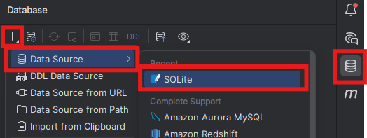
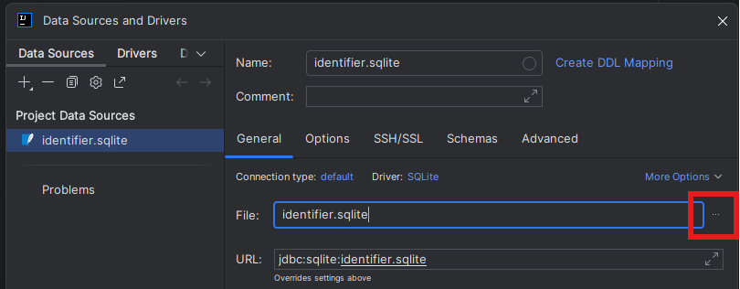
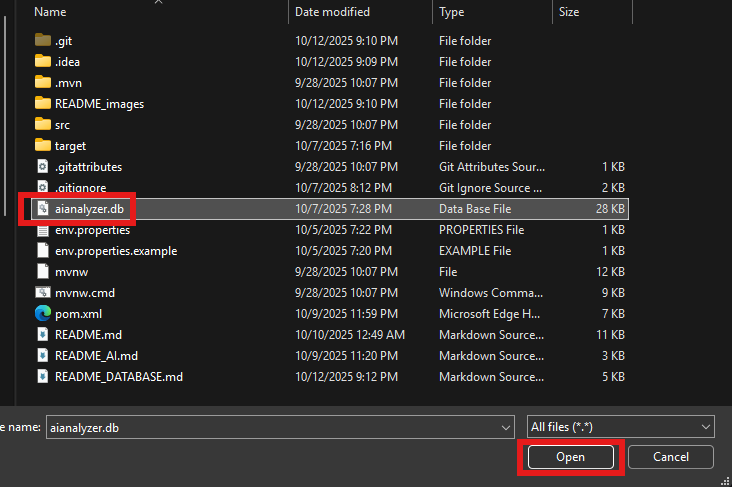
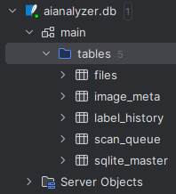

# How to Test the AIAnalyzer Database in IntelliJ

This guide explains how to run the application to test the database functionality and how to view the SQLite database directly inside IntelliJ.

## Setup Instructions

> [!WARNING]
> **API Key Required:** The application will not run without a valid Gemini API key. Before proceeding, please see **[README_AI.md](README_AI.md)** for instructions on how to get a key and configure it for the project.

### Connecting IntelliJ to the SQLite Database
1.  **Run `AiAnalyzerApplication.java` once.** This will create the `aianalyzer.db` file in your project's root directory. You can stop the application after it has started.
2.  Open the **Database** tool window in IntelliJ (View -> Tool Windows -> Database).
3.  Click the **`+`** icon -> Data Source -> SQLite.

<p align="center">
    
</p>

4.  For the `File`, point it to the `aianalyzer.db` file that was just created in your project root.

<p align="center">
  
  
</p>
<p align="center"><em>Selecting and confirming the SQLite file</em></p>

5.  You will likely see a warning about a missing driver. Click the **"Download missing driver files"** link.
6.  **Important:** After the download finishes, click **`Apply`** first, and then click **`OK`**.
7.  In the Database tool window, right-click your `aianalyzer.db` connection, and select **Refresh**. You should now see all the application tables.

<p align="center">
  
</p>

> [!NOTE]
> You may need to right-click the aianalyzer.db and click Refresh to see the populated tables. MAKE SURE the application is not running when you click refresh.

## Core Architecture: Producer-Consumer Queue

Our backend uses a "producer-consumer" pattern with the database acting as a task queue.

1.  **Production (Adding a Task):** The `ActiveScanService` or `PassiveScanService` discovers a new file. It creates a `ScanQueueItem` and saves it to the `scan_queue` table.
2.  **Consumption (Grabbing a Task):** The `FileProcessingService` runs on a schedule. It queries the `scan_queue` table for items that are ready to be processed.
3.  **Processing (Doing the Work):** For each item, the service reads the file's metadata from the disk (size, date, etc.).
4.  **Storage (Saving the Result):** The service creates a new `FileRecord` with this metadata and saves it to the main `files` table.
5.  **Cleanup (Removing the Task):** After the file is successfully stored, the original `ScanQueueItem` is deleted from the queue.

## Key Packages & Files

* `application.properties`: Contains the SQLite database connection URL and Hibernate settings (`ddl-auto`).
* `model/database/`: Contains all JPA `@Entity` classes (e.g., `FileRecord`). Each class here defines a database table schema.
* `repository/database/`: Contains all Spring Data JPA interfaces (like `FileRecordRepository`). These provide the methods (`find`, `save`, `delete`) to perform database operations without writing SQL.
* `service/database/`: Contains the services that implement the producer-consumer logic described above (`ActiveScanService`, `PassiveScanService`, `FileProcessingService`).

## Refactoring History: Old vs. New

To help understand the recent refactor, here is a mapping of the old code to its new equivalent.

### Application Startup
```diff
- Old: Main.java
+ New: AiAnalyzerApplication.java
# Improvement: Spring Boot now handles all startup, configuration, and dependency injection automatically.
```

### Database Connection & Schema Setup
```diff
- Old: DatabaseManager.java (with hardcoded SQL CREATE TABLE statements)
+ New: The @Entity classes in model/database/ and settings in application.properties.
# Improvement: The database schema is now managed automatically from our Java entity classes.
```

### Database Queries
```
- Old: Manual PreparedStatement and raw SQL strings
+ New: The interfaces in the repository/database/ package.
# Improvement: Spring Data JPA writes the SQL for us, which is safer and cleaner.
```

### Initial File System Scan (The "Producer")
```diff
- Old: ActiveScanner.java, FsIndexer.java, PassiveScanner.java
+ New: ActiveScanService.java (for full scans) and PassiveScanService.java (for real-time monitoring).
# Improvement: The logic is now in focused Spring @Service beans, making it easier to manage and test.
```

### Queue Processing (The "Consumer")
```diff
- Old: QueueWorker.java
+ New: FileProcessingService.java
# Improvement: This service now uses the repository interfaces to get its work.
```

### Applying AI Labels
```diff
- Old: LabelService.java
+ New: The new Spring-based LabelService.java
# Improvement: The new service uses the repository pattern, removing all manual SQL.
```


